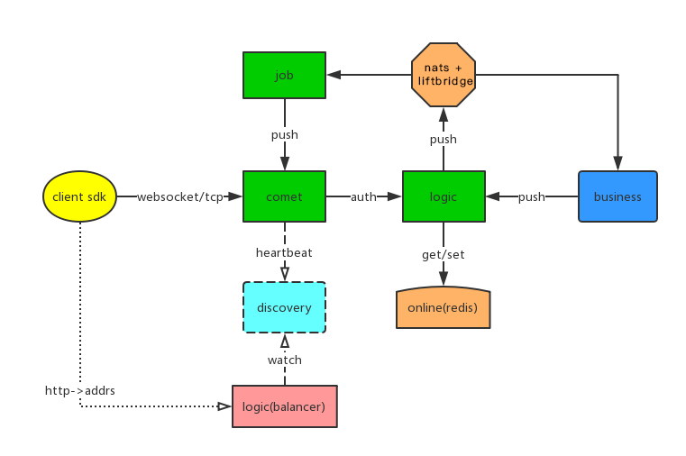

# (Experimental) goim via nats (试验结束)
fork from [goim](https://github.com/Terry-Mao/goim)  and support nats  to replace kafka / zookeeper


## 0. chinese note 中文说明
```
*****************************************
*                                       *
*   更换 kafka 目标达成, 本项目暂时冻结      *
*                                       *
*****************************************
```


--------------
 请转到  [github.com/tsingson/goim](https://github.com/tsingson/goim) 获取最新更新
 
 please check out  [github.com/tsingson/goim](https://github.com/tsingson/goim) for new update 

------------


goim 是 非常成功的 IM 原型( 即时消息平台), 依赖项为 kafka ( 消息队列) + zookeeper ( 扩展/均衡 ) + bilibili/discovery( 服务发现) , 为简化 kafka / zk 的复杂部署参数配置与 jvm 依赖, 这里 fork 了 goim 并修改为 [nats](https://github.com/nats-io/gnatsd) + [liftbridge](https://github.com/liftbridge-io/liftbridge) , 由   [nats](https://github.com/nats-io/gnatsd) 实现 简化版的 kafka 队列功能 + zookeeper 的集群协调, 由  [liftbridge](https://github.com/liftbridge-io/liftbridge)  实现 nats 消息的持久化

由于修改比较大, 暂时用新的 repo 来进行代码管理


**重要警告**:

**这个 fork 是实验性质练手项目, 请不要用于生产环境!!  **

**this repo personal Experimental , DO NOT use in production!!**


### 1. Movation 动机

作为一个曾经的架构师(2005~2014, Utstarcom IPTV/OTT 事业部) 与当前自由的技术类咨询与服务从业者, 有合作伙伴询问 IM 用在视频直播中的 IM 方案, 我作了一些学习与研究 

中国 B站( BiliBili ) 的技术领军 [毛剑](https://github.com/Terry-Mao/) 是我神交以久的技术专家,   [goim](https://github.com/Terry-Mao/goim)  是一个非常成功的架构示例, 其模块拆分, 接口设计, 技术选型 ,部署方式 以及持续改进演变, 都是一个互联网商用项目典范.  


同时,  另一位技术专家 [Xin.zh](https://github.com/alexstocks) 的文章 [一套高可用实时消息系统实现](https://alexstocks.github.io/html/pubsub.html)  给我很大启发.  

在电信/广电的几年经历, 这一次,  闲来无事, 算是满怀着在巨人肩头的感谢与敬意, 尝试写一些代码来加深学习.  


**感谢两位技术专家, 感谢开源社区**


个人在 Utstarcom 以业务平台架构师/解决方案工程师/ IPTV播控产品线 release manager 角色有一些时间,  除了技术方案的原型代码撰写与演示以外, 甚少参与实际撰写代码的工作 ,  这次写写代码也是有趣的练习  :P

欢迎指点/交流....


### 2. 主要变更




  - [x] 消息队列修改为 [nats](https://github.com/nats-io/gnatsd) + [liftbridge](https://github.com/liftbridge-io/liftbridge)  注:  [liftbridge](https://github.com/liftbridge-io/liftbridge) 替代了 [nats-streaming-server](https://github.com/nats-io/nats-streaming-server) , 相关信息参见[liftbridge介绍文章](https://bravenewgeek.com/introducing-liftbridge-lightweight-fault-tolerant-message-streams/)
  - [x] 日志替换为 [uber-go/zap](https://github.com/uber-go/zap), 替换原一是因为 zap 快一点, 二是个人更为熟悉这个日志库 
  - [x] 修改了三个应用程序的启动方式, 去除了所有启动参数, 改为读取指定的 toml 配置文件( 同时, 预留接口以久将来进行读取远程配置, 及配置参数动态加载) 


### 3. 变更文件结构
修改文件如下示意, 支持 nats 的应用程序在以下路径, 每个应用下的 toml 为对应的配置
/cmd/nats/discoveryd-config.toml 为  discovery 的配置

```
├── cmd
│   └── nats
│       ├── comet
│       │   ├── comet-config.toml
│       │   └── main.go
│       ├── discoveryd-config.toml
│       ├── job
│       │   ├── job-config.toml
│       │   └── main.go
│       └── logic
│           ├── logic-config.toml
│           └── main.go
```

支持 nats 的库文件在 
```
/internal/nats/
```
路径下, 除配置文件以外, 所有库的调用方式与原 goim 相同


###  4. goim guide 安装/编译/使用指南(WIP)
参见 [/goim-usage-cn.md](goim-usage-cn.md) ( chinese )


# Change Plan 变更计划

有几位朋友私信沟通闲聊, 想要一个同时支持 kafka / nats , 以便能 merge 回这里的主线, 我 fork 了一个 repo 来尝试实现这个想法, 这里 https://github.com/tsingson/goim, 在将来几天内处理完成

计划变更如下:
  - [x] 在 internal/logic/conf 与 internal/job/conf 中增加 nats 的连接配置项, 与 选择 kafka ( 默认) 或 nats 的开关配置项
  - [x] 把 internal/logic/dao 抽象为 interface , 同时支持 kafka / nats ( 仅是 nats )
  - [x] 把 internal/job 中 func (j *Job) Consume() 函数拆分为  func (j *Job) Consume() 支持 kafka / func (j *Job) ConsumeNats()  支持 nats

除以上变更外, 所有代码尽量保持不变

以上, 祝愉快.

----------------

Some friends ask to [https://github.com/Terry-Mao/goim](https://github.com/Terry-Mao/goim) support the kafka / nats. 
I forked a repo to try to implement this idea, here https://github.com/tsingson/goim, Completed in the next few days

The plan changes are:

   - [ ] Add nats connection configuration in internal/logic/conf and internal/job/conf, and switch configuration for kafka (default) or nats
   - [ ] Abstract internal/logic/dao as interface to support kafka / nats (only nats, no liftbridge )
   - [ ] Split the func (j *Job) Consume() function in internal/job into func (j *Job) Consume() Support kafka ( default) / func (j *Job) ConsumeNats() Support nats

it's all.

ps, wish you happiness.


为简化配置, 新增 /third-party/ 将 nats / liftbridge / discovery 放在这里, 并加入到 Makefile 中, 可以在本 repo 在编译依赖


**proto 生成go**
```
cd ./api/comet/grpc

protoc  -I=$HOME/go/src -I=/usr/local/include  -I=./ --gofast_out=plugins=grpc:.  ./*.proto

cd ./api/logic/grpc

protoc  -I=$HOME/go/src -I=/usr/local/include  -I=./ --gofast_out=plugins=grpc:.  ./*.proto


```


**build 参数**

```
go install -gcflags=-trimpath=OPATH -asmflags=-trimpath=OPATH -a -tags netgo -ldflags "-w -s -extldflags '-static'" ./cmd/nats/comet/

或 go build -gcflags=-trimpath=OPATH -asmflags=-trimpath=OPATH -a -tags netgo -ldflags "-w -s -extldflags '-static'" -o ./dist/linux/comet ./cmd/nats/comet/
```


请查看 [/Makefile](/Makefile) , 运行 make 

**编译**
```
make setup
make build-linux
make build-mac
```
或者 
```
make setup
make build-mac
```

**运行**
```
make run-linux
make run-mac
```

**注意**:

由于 bilibili/discovery 中[我修改的代码代码](/third-party/discoveryd/)使用了 [https://github.com/sevlyar/go-daemon](https://github.com/sevlyar/go-daemon)  不支持 windows, 所以, 如果需要在 windows 下运行, 请自行修改 /third-party-discoveryd 去除 daemon 


**清除编译**

```
make clean
```


____________________

goim v2.0
==============

[](https://travis-ci.org/Terry-Mao/goim) 
[](https://goreportcard.com/report/github.com/Terry-Mao/goim)
[](https://codecov.io/gh/Terry-Mao/goim)

goim is a im server writen by golang.

## Features
 * Light weight
 * High performance
 * Pure Golang
 * Supports single push, multiple push and broadcasting
 * Supports one key to multiple subscribers (Configurable maximum subscribers count)
 * Supports heartbeats (Application heartbeats, TCP, KeepAlive, HTTP long pulling)
 * Supports authentication (Unauthenticated user can't subscribe)
 * Supports multiple protocols (WebSocket，TCP，HTTP）
 * Scalable architecture (Unlimited dynamic job and logic modules)
 * Asynchronous push notification based on Kafka

## Architecture


## Quick Start

### Build
```
    make build
```

### Run
```
    make run
    make stop

    // or
    nohup target/logic -conf=target/logic.toml -region=sh -zone=sh001 deploy.env=dev weight=10 2>&1 > target/logic.log &
    nohup target/comet -conf=target/comet.toml -region=sh -zone=sh001 deploy.env=dev weight=10 addrs=127.0.0.1 2>&1 > target/logic.log &
    nohup target/job -conf=target/job.toml -region=sh -zone=sh001 deploy.env=dev 2>&1 > target/logic.log &

```
### Environment
```
    env:
    export REGION=sh
    export ZONE=sh001
    export DEPLOY_ENV=dev

    supervisor:
    environment=REGION=sh,ZONE=sh001,DEPLOY_ENV=dev

    go flag:
    -region=sh -zone=sh001 deploy.env=dev
```
### Configuration
You can view the comments in target/comet.toml,logic.toml,job.toml to understand the meaning of the config.

### Dependencies
[Discovery](https://github.com/Bilibili/discovery)

[Kafka](https://kafka.apache.org/quickstart)

## Document
[Protocol](./docs/protocol.png)

[English](./README_en.md)

[中文](./README_cn.md)

## Examples
Websocket: [Websocket Client Demo](https://github.com/Terry-Mao/goim/tree/master/examples/javascript)

Android: [Android](https://github.com/roamdy/goim-sdk)

iOS: [iOS](https://github.com/roamdy/goim-oc-sdk)

## Benchmark


### Benchmark Server
| CPU | Memory | OS | Instance |
| :---- | :---- | :---- | :---- |
| Intel(R) Xeon(R) CPU E5-2630 v2 @ 2.60GHz  | DDR3 32GB | Debian GNU/Linux 8 | 1 |

### Benchmark Case
* Online: 1,000,000
* Duration: 15min
* Push Speed: 40/s (broadcast room)
* Push Message: {"test":1}
* Received calc mode: 1s per times, total 30 times

### Benchmark Resource
* CPU: 2000%~2300%
* Memory: 14GB
* GC Pause: 504ms
* Network: Incoming(450MBit/s), Outgoing(4.39GBit/s)

### Benchmark Result
* Received: 35,900,000/s

[中文](./docs/benchmark_cn.md)

[English](./docs/benchmark_en.md)

## LICENSE
goim is is distributed under the terms of the MIT License.
